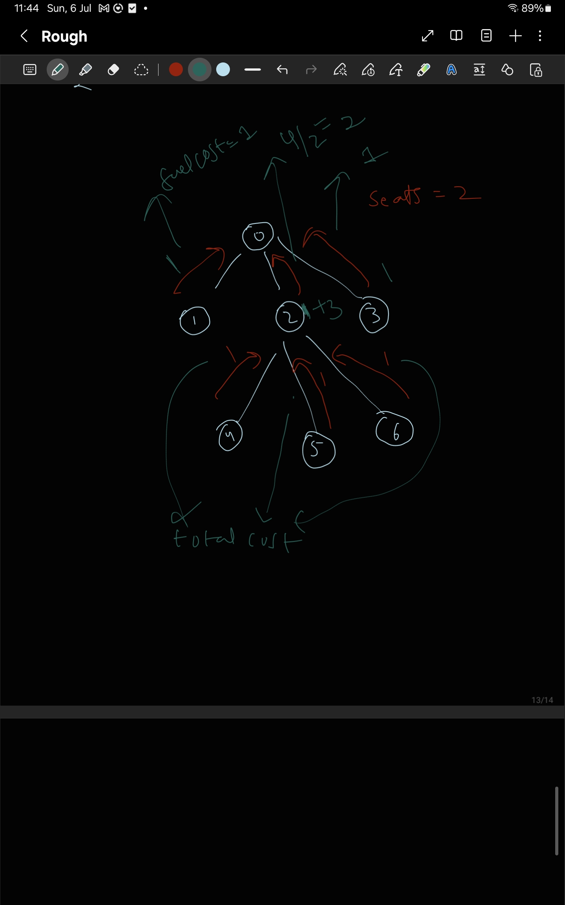

# Problem Title: [LeetCode 2477 - Minimum Fuel Cost To Report To Capital](https://leetcode.com/problems/minimum-fuel-cost-to-report-to-the-capital/description/)

## 🚀 Problem Summary
Given n cities, 0 to n-1 . 
and n-1 edges . 

Forms graph : connected and undirected. 
Basically its a tree.

at each city we have a car. 
car capacity is seats.

each person tries to move to node 0 .
for 1 edge travelling 1ltr fuel gets consumed.

find minimum fuel to travel to node 0 . multiple people can go in one car.

## 🧩 Example:


## 🔍 Key Observations
- at each node if there are x people then it requires ceil( x / seats ) number of cars 
minimum to go from that node to the parent node.
- at any given node there will be subtrees and all the nodes present in each subtree must go through the given node.
- they might reach at different times. but it is optimal to wait every one to come and go in 
minimum number of cars from that given node to its parent node.
- cars always travel to parent node from a given node because it wastes two units of fuel to go down and come up where as from bottom to top they would have come in one unit of fuel.

## 🛠️ Approach
- Describe your solution in 3–5 steps:
  1. so for each child subtree of a given node we can get NUMBER OF PEOPLE from that child as a subprobelm
  2. once we get NUMBER OF PEOPLE we can use that to update the global cost it takes to come from that child node to the given node and we can also add NUMBER OF PEOPE to the number of people comes to the current given node

## 🧪 Time and Space Complexity
- **Time:** O(log n)
- **Space:** O(log n)

## ✅ Code (Language)
```lang
# your code here
int x = 0


